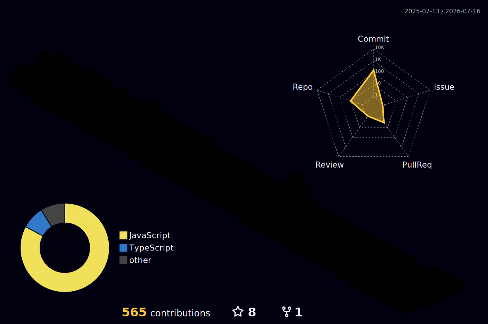

<!-- ═══════════════════════════ HEADER BANNER ═══════════════════════════ -->
<div align="center">


<!-- Typing animation -->
<a href="https://github.com/Thananontnc">
  
</a>

<!-- Profile views + followers -->
<p>
  
  <a href="https://github.com/Thananontnc?tab=followers">
    
  </a>
</p>

</div>

<!-- ═══════════════════════════ ABOUT ═══════════════════════════ -->
## 🦁 About Me

```typescript
const thananon = {
  role: "Full-Stack Developer",
  location: "Thailand 🇹🇭",
  focus: ["Next.js", "React", "TypeScript"],
  currentProject: "Simba Spark — senior project",
  learning: "System design & clean architecture",
  motto: "Ship it, then make it beautiful ✨",
};
```

- 🔭 Currently building **Simba Spark** (a Next.js app)
- 🌱 Deep-diving into **server actions, ABAC, and clean UI**
- 🎨 I care about **minimalist design** as much as working code
- ⚡ Fun fact: I redesign my own admin panels for fun

<!-- ═══════════════════════════ TECH STACK ═══════════════════════════ -->
## 🛠️ Tech Stack

<div align="center">

### Languages


### Frameworks & Libraries


### Tools & Platforms


</div>

<!-- ═══════════════════════════ 3D CONTRIBUTION GRAPH ═══════════════════════════ -->
## 🎮 My 3D Contribution Graph

<div align="center">

<!-- Auto-generated daily by the GitHub Action in .github/workflows/3d-contrib.yml -->


</div>

> 💡 This isometric 3D graph is generated automatically every day from my commit activity.

<!-- ═══════════════════════════ GITHUB STATS ═══════════════════════════ -->
## 📊 GitHub Stats

<div align="center">


<br/>


<br/>

<!-- Trophies -->


</div>

<!-- ═══════════════════════════ CONTRIBUTION SNAKE ═══════════════════════════ -->
## 🐍 Contribution Snake

<div align="center">


</div>

<!-- ═══════════════════════════ CONNECT ═══════════════════════════ -->
## 🌐 Connect With Me

<div align="center">

<a href="mailto:thananonza123@gmail.com">
  
</a>
<a href="https://github.com/Thananontnc">
  
</a>

</div>

<!-- ═══════════════════════════ FOOTER ═══════════════════════════ -->
<div align="center">


⭐️ From [Thananontnc](https://github.com/Thananontnc)

</div>
