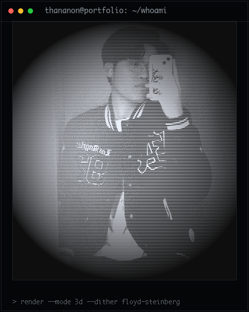

<!-- ═══════════════════════ NEOFETCH HEADER ═══════════════════════ -->
<table width="100%">
<tr>
<td width="42%" align="center" valign="top">



</td>
<td width="58%" valign="top">

```console
pie@github ~ % whoami
───────────────────────────────
 user    Thananon "Pie" Chounudom
 role    Full-stack & Data Engineer
 host    Thailand
 shell   Next.js · React · Python
 uptime  building things that feel good
───────────────────────────────
 build   Simba Spark — Next.js senior project
 learn   system design · ABAC · data pipelines
 care    minimalist UI & clean architecture
───────────────────────────────
 email   thananonza123@gmail.com
 github  github.com/Thananontnc
```

</td>
</tr>
</table>

<!-- ═══════════════════════ STACK ═══════════════════════ -->

```console
pie@github ~ % ls ~/stack
```

<div align="center">


</div>

<!-- ═══════════════════════ CONTACT ═══════════════════════ -->

```console
pie@github ~ % ./contact --open
> opening links...
```

<div align="center">

<a href="https://github.com/Thananontnc/thx-tnc-Portfolio-V.2"></a>
<a href="mailto:thananonza123@gmail.com"></a>
<a href="https://github.com/Thananontnc"></a>


</div>

<br/>

```console
pie@github ~ % _
```
