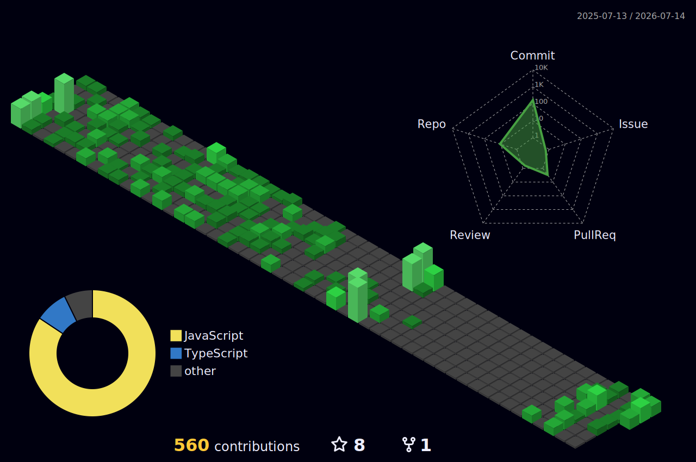

<!-- ══════════════════════════ HERO ══════════════════════════ -->
<div align="center">


<br/><br/>

```
> whoami
thananon — full-stack developer · thailand
```


</div>

<br/>

<!-- ══════════════════════════ ABOUT ══════════════════════════ -->
### `~/about`

```
build     · Simba Spark — Next.js senior project
learning  · system design · ABAC · clean UI
care      · minimalist design as much as working code
```

<br/>

<!-- ══════════════════════════ STACK ══════════════════════════ -->
### `~/stack`

<div align="left">


</div>

<br/>

<!-- ══════════════════════════ 3D CONTRIB ══════════════════════════ -->
### `~/contributions --3d`

<div align="center">



</div>

<br/>

<!-- ══════════════════════════ STATS ══════════════════════════ -->
### `~/stats`

<div align="center">


</div>

<br/>

<!-- ══════════════════════════ CONNECT ══════════════════════════ -->
### `~/connect`

<a href="mailto:thananonza123@gmail.com">
  
</a>
<a href="https://github.com/Thananontnc">
  
</a>

<br/><br/>

<div align="center">
  
</div>
